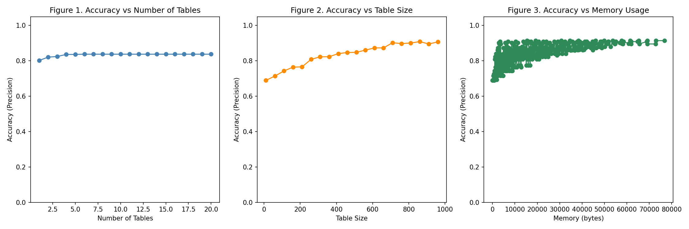

# Count-Min Sketch for Network Traffic Monitoring

## Overview

This project implements the **Count-Min Sketch (CMS)** probabilistic data structure in C for detecting high-frequency IP addresses in streaming network traffic under limited memory constraints.

Count-Min Sketch is a memory-efficient streaming algorithm widely used in networking, databases, and cybersecurity to estimate item frequencies without storing every observation. This implementation demonstrates how CMS can serve as a first-line defence for identifying potentially suspicious IP addresses in high-volume network streams.

In addition to the core implementation, this repository includes an **experimental evaluation** that investigates the trade-off between memory usage and detection precision by varying the number and size of Count-Min Sketch tables.

---

## Features

- Memory-efficient frequency estimation
- Multiple independent hash functions
- Threshold-based IP address detection
- Streaming updates with constant-time insertion
- Configurable sketch dimensions (number and size of hash tables)
- Dynamic memory allocation and cleanup
- Experimental evaluation of memory–precision trade-offs

---

## Algorithm

For each incoming IP address:

1. Hash the IP address using multiple independent hash functions.
2. Increment the corresponding counter in each Count-Min Sketch table.
3. Estimate the frequency as the minimum counter across all hash tables.
4. Flag IP addresses whose estimated frequency exceeds a specified threshold.

This implementation follows the Count-Min Sketch algorithm introduced by **Cormode and Muthukrishnan**.

---

## Repository Structure

```
Network-Traffic-Monitoring/

├── README.md
├── Makefile
├── .gitignore
├── report.pdf
│
├── src/
│   ├── cms.c
│   └── cms_experiment.c
│
└── examples/
    ├── input.txt
    ├── output.txt
    ├── experiment_input.txt
    └── experiment_output.txt
```

---

## Files

### `cms.c`

Implements the core Count-Min Sketch algorithm for streaming IP address frequency estimation and threshold-based detection.

### `cms_experiment.c`

Evaluates the performance of Count-Min Sketch by varying:

- Number of hash tables
- Hash table size
- Memory usage

The program outputs CSV-formatted results that can be used to analyse the trade-off between memory consumption and detection precision.

### `report.pdf`

A short report describing the implementation, experimental methodology, and evaluation of the Count-Min Sketch algorithm.

---

## Building

Compile both programs using the included Makefile:

```bash
make
```

Alternatively, compile manually:

```bash
gcc -Wall -O2 -o cms src/cms.c -lm
gcc -Wall -O2 -o cms_experiment src/cms_experiment.c -lm
```

---

## Running

Run the main implementation:

```bash
make run
```

or

```bash
./cms < examples/input.txt
```

Run the experimental evaluation:

```bash
make run-experiment
```

or

```bash
./cms_experiment < examples/experiment_input.txt
```

---

## Example Output

```
Flagging ip address: 192.168.001.001 up to 8 accesses.
```

Example experimental output:

```
num_tables,table_size,memory,precision
4,100,1600,0.974
6,200,4800,0.993
...
```

---

## Experimental Results

The figure below illustrates the relationship between memory allocated to the Count-Min Sketch and detection accuracy. As table size increases, memory increases, hash collisions decrease, leading to more accurate frequency estimates.



*Figure 1. Detection accuracy as a function of Count-Min Sketch memory allocation.*

---

## Time and Space Complexity

For a Count-Min Sketch with **d** hash tables and width **w**:

| Operation | Complexity |
|-----------|-----------:|
| Insert | O(d) |
| Query | O(d) |
| Memory | O(d × w) |

---

## Technologies

- C
- Dynamic Memory Allocation
- Hash Functions
- Streaming Algorithms
- Probabilistic Data Structures
- Algorithm Performance Evaluation

---

## Concepts Demonstrated

- Count-Min Sketch
- Approximate Frequency Estimation
- Network Traffic Monitoring
- Memory-Efficient Algorithm Design
- Hash-Based Data Structures
- Algorithm Analysis
- Experimental Evaluation
- Performance Benchmarking

---

## Possible Applications

- Network intrusion detection
- Detection of high-frequency or suspicious IP addresses
- Distributed network monitoring
- Large-scale traffic analysis
- Approximate frequency estimation for streaming data